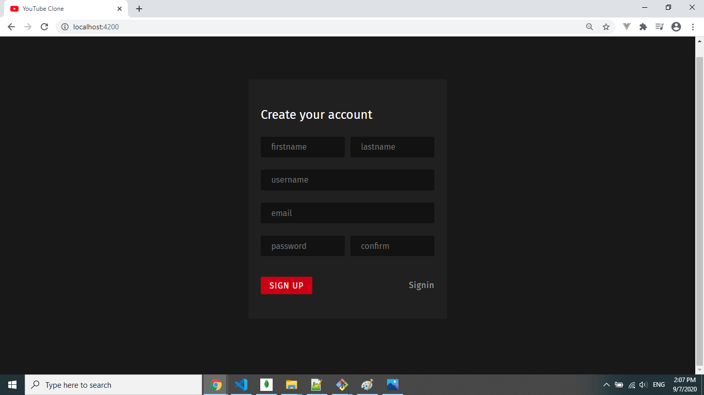
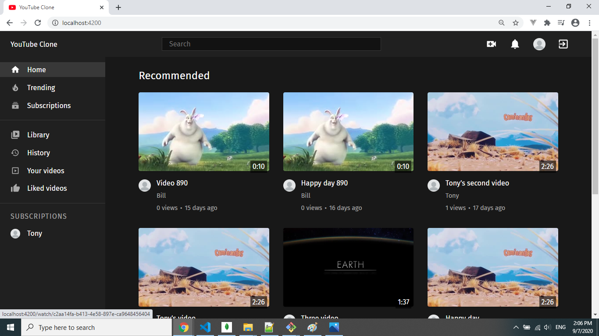
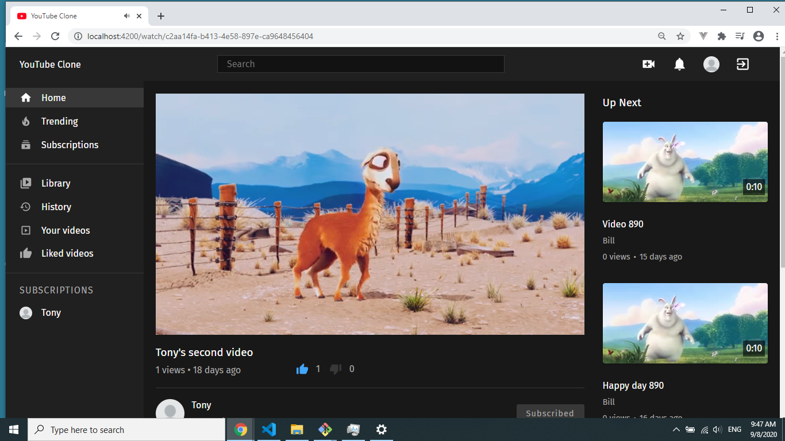
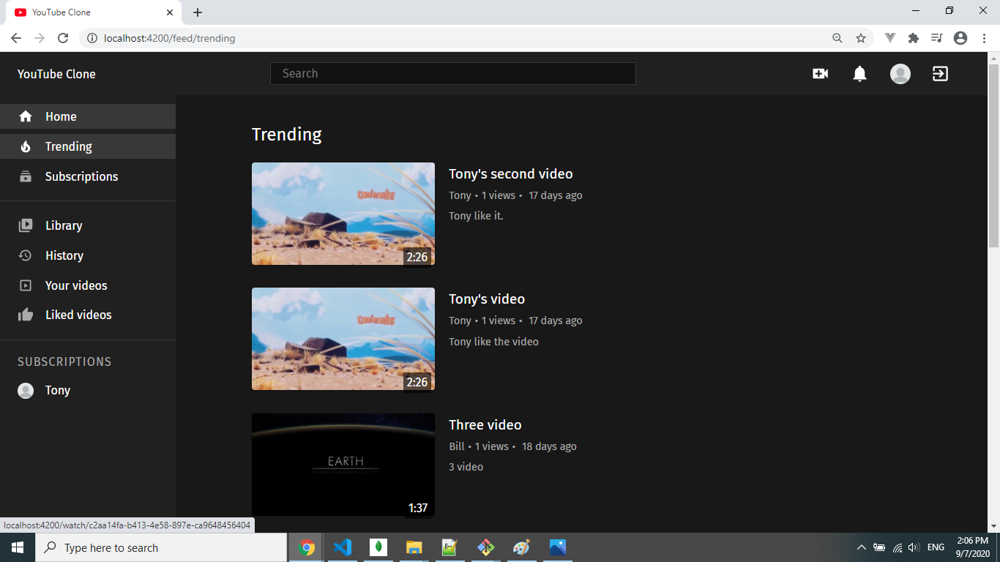
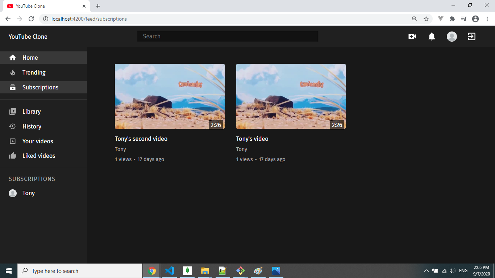
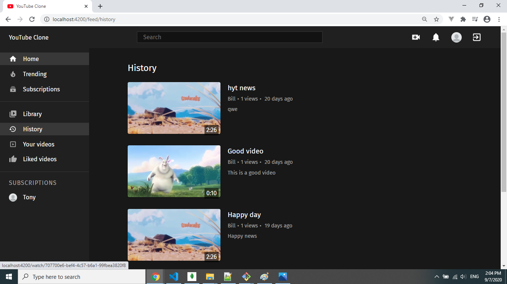
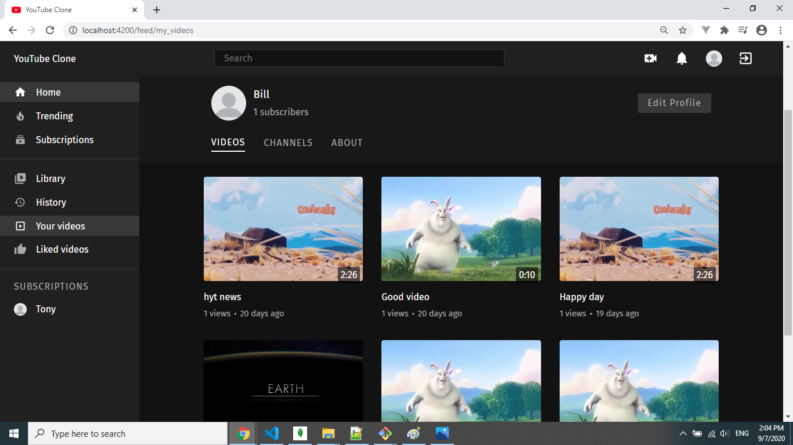
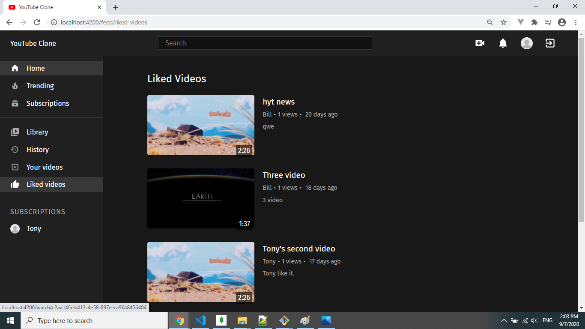
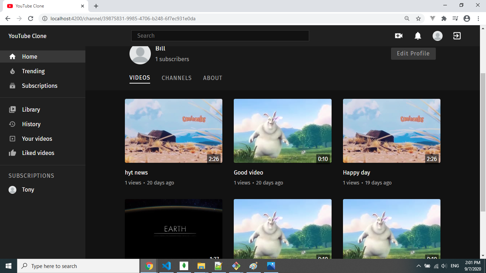

# Youtube Clone Frontend

Youtube clone using PERN stack (Postgres, Express, React, and Node). 

This is the frontend repository, built with React + Redux. For the backend repository, [click here](https://github.com/Yongtai-Huang/youtube-clone-backend)

## Core packages

1. Redux - State Management
2. React Router - Routing
3. Styling - Styled Components
4. Network calls - Axios
5. Toast Notifications - React Toastify
6. Video player - Videojs

## Video uploads
Upload videos to server 

## Functionality

1. Signup/Login
2. Upload video
3. Watch videos
4. Search videos
5. Like/Dislike video
6. Subscribe/Unsubscribe from channels
7. Add, update, and delete comment
8. Edit profile


## Running

At the root of your project create an .env file with the following contents:

```javascript
BROWSER=none
PORT=4200
REACT_APP_BACKEND_URL="http://localhost:3000/api"
REACT_APP_VIDEO_ENDPOINT="http://localhost:3000/upload/videos"
```

Then run <code>npm install</code> to install required packages

Run <code>npm start</code> to start the frontend and visit http://localhost:4200/


## UI

### Signup



### Home



### Play



### Trending



### Subscriptions



### Watch History



### Your Videos



### Liked Videos



### Profile


